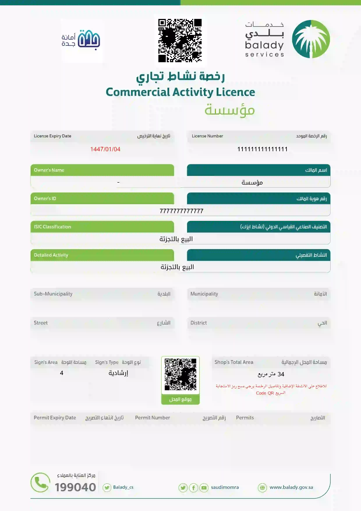

## إصدار تقرير فني سلامة بلدي تقرير فني فوري أو غير فوري تقرير سلامة تقرير فني غير فوري لتجديد رخصة البلدية

## تقرير فني هندسي سلامة
في المملكة العربية السعودية، تتطلب العمليات المتعلقة بإصدار وتجديد رخص البلدية الكثير من الإجراءات والمتطلبات القانونية والتنظيمية. واحدة من الأدوات الحيوية التي تسهل هذه الإجراءات هي بوابة "سلامة"، وهي منصة إلكترونية تهدف إلى تعزيز الكفاءة والشفافية في تقديم خدمات السلامه .

من بين الميزات المهمة لهذه البوابة هو "رقم التقرير الفني"، الذي يلعب دورًا حاسمًا في عملية إصدار وتجديد رخص البلدية.

بوابة سلامة
بوابة سلامة هي منصة رقمية أطلقتها المملكة العربية السعودية لتوفير مجموعة من الخدمات الإلكترونية المتعلقة بالأمان والسلامة العامة. تهدف البوابة إلى تسهيل عملية التواصل بين الأفراد والجهات الحكومية، وتوفير المعلومات اللازمة لإصدار وتجديد مختلف أنواع الرخص البلدية.

رقم التقرير الفني

ما هو رقم التقرير الفني؟

رقم التقرير الفني هو رقم مرجعي فريد يتم إصداره لكل تقرير فني يتم إعداده من قبل الجهات المختصة. هذا الرقم يسهل تتبع ومراجعة التقارير الفنية المتعلقة بالمنشآت والأنشطة التي تتطلب رخص بلدية. يتضمن التقرير الفني معلومات تفصيلية حول حالة المنشأة ومدى التزامها باللوائح والمعايير المعمول بها.

أهمية رقم التقرير الفني

التتبع والمراجعة: يسهل رقم التقرير الفني عملية تتبع التقارير الفنية ومراجعتها من قبل الجهات المعنية. يمكن من خلاله الرجوع إلى التقارير السابقة والتحقق من الامتثال المستمر للمعايير.

الشفافية: يساهم في تعزيز الشفافية في عملية إصدار وتجديد الرخص، حيث يمكن للجهات المعنية والأفراد التحقق من حالة التقارير الفنية والملاحظات المرفقة بها.

الكفاءة: يساهم في تحسين كفاءة عملية إصدار وتجديد الرخص من خلال تسهيل الوصول إلى المعلومات الفنية المطلوبة واتخاذ القرارات المستنيرة بناءً عليها.
كيفية الحصول على رقم التقرير الفني

للحصول على رقم التقرير الفني، يجب على صاحب المنشأة أو مقدم الطلب تقديم طلب عبر بوابة سلامة. يتضمن الطلب تقديم المعلومات اللازمة حول المنشأة والنشاط المطلوب ترخيصه. بعد مراجعة الطلب، يقوم المختصون بإعداد تقرير فني شامل يتم منحه رقم مرجعي فريد (رقم التقرير الفني).

خطوات إصدار وتجديد رخص التجارية عبر بوابة سلامة
تقديم الطلب: يدخل المستخدم إلى بوابة سلامة ويقوم بتقديم طلب لإصدار أو تجديد الرخصة.

إعداد التقرير الفني: يتم تكليف الجهة المختصة بإعداد تقرير فني يشمل فحص المنشأة وتقييم مدى التزامها باللوائح والمعايير.

منح رقم التقرير الفني: بعد إعداد التقرير الفني، يتم منحه رقم مرجعي فريد يمكن من خلاله تتبع التقرير.

المراجعة والموافقة: تقوم الجهات المعنية بمراجعة التقرير الفني واتخاذ القرار بشأن إصدار أو تجديد الرخصة بناءً على المعلومات المتوفرة في التقرير.
إصدار الرخصة: في حال الموافقة، يتم إصدار الرخصة البلدية وتحميلها عبر بوابة سلامة.

الخاتمة
يمثل رقم التقرير الفني عنصرًا أساسيًا في عملية إصدار وتجديد رخص البلدية عبر بوابة سلامة، حيث يساهم في تعزيز الكفاءة والشفافية في تقديم الخدمات البلدية. من خلال تسهيل تتبع التقارير الفنية ومراجعتها، يتمكن الأفراد والجهات الحكومية من ضمان الامتثال للمعايير واللوائح المعمول بها، مما يعزز من مستوى الأمان والسلامة العامة في المجتمع.

## رقم التقرير الفني
عند اصدار رخصة بلدية جديد او تجديد رخصة لنشاط فوري يطلب منك رقم التقرير الفني ، وعند تجديد رخصة بلدية لنشاط غير فوري يطلب منك تقرير فني 
يقوم باصدار التقرير الفني مكتب هندسي متخصص بمجال السلامة من الحريق معتمد من قبل ادارة الدفاع المدني 

وحيث اننا مؤهلون من اداة الدفاع المدني كمكتب هندسي نوفر لك ماتحتاجه لاصدار رخصتك بكل سهولة

ابدا الان

## متطلبات الحصول علي رقم التقرير الفني
الرقم الموحد للمنشاة
رقم السجل التجاري للمنشاة
بيانات الموقع 
المنطقة 
المدينة
الحي 
الشارع
عدد الادوار 
عدد الفتحات
المساحة طبقا لعقد الايجار الموثق
رقم الجوال
الايميل 
تحديد النشاط الخاص بالمنشاة ( رقم نشاط الايزك )

ابدا الان

## تقرير سلامة الدفاع المدني
يعد إعداد تقرير سلامة من قبل جهة معتمدة لدى الدفاع المدني خطوة ضرورية لضمان أن المنشأة تلتزم بأعلى معايير السلامة والأمان. يقدم تقرير السلامة تحليلاً شاملاً لأجهزة وأنظمة الوقاية المتوفرة في المنشأة، مما يساعد في تحديد مدى توافقها مع اللوائح والمعايير الوطنية..

أهمية تقرير السلامة
تقييم شامل لأنظمة السلامة:
يقوم تقرير السلامة بتقييم جميع الأجهزة والمعدات المتعلقة بالوقاية من الحريق، مثل طفايات الحريق، أنظمة الإنذار المبكر، sprinklers (أنظمة الرشاشات)، ومخارج الطوارئ.

 
تحديد نقاط الضعف:
يساهم التقرير في تحديد الجوانب التي تحتاج إلى تحسينات أو تحديثات، مما يساعد أصحاب العمل على اتخاذ الإجراءات اللازمة لتحسين مستوى الأمان.
التوصيات الدقيقة:
يقدم تقرير السلامه توصيات دقيقة حول كيفية تعزيز إجراءات السلامة وتطويرها، مما يتيح لأصحاب العمل تنفيذ الخطوات اللازمة لضمان بيئة عمل آمنة للعاملين والزوار.
نموذج تقرير سلامة
فوائد إعداد تقرير السلامه بانتظام ؟
الامتثال القانوني:
إعداد تقرير السلامة بانتظام يضمن الامتثال للقوانين واللوائح المحلية، مما يجنب المنشأة الغرامات أو العقوبات القانونية.
تحديث الأنظمة:
يساعد التقرير في متابعة التحديثات المستمرة على أنظمة الأمان، مما يعزز من كفاءة الأجهزة ويقلل من مخاطر الحوادث.
تعزيز سلامة الموظفين والزوار:
من خلال تحسين إجراءات السلامة، يتم توفير بيئة عمل أكثر أمانًا، مما يقلل من مخاطر الحوادث ويحمي الأرواح والممتلكات.

كيفية إعداد تقرير السلامة؟
الفحص الميداني:
تقوم جهة معتمدة لدى الدفاع المدني بإجراء فحص ميداني شامل للمنشأة لتقييم حالة الأجهزة والمعدات.
تحليل النتائج:
يتم تحليل نتائج الفحص وإعداد تقرير السلامه الذي يتضمن التوصيات اللازمة لتحسين مستوى الأمان.
اعتماد التقرير:
بعد إعداد التقرير، يتم اعتماده من الجهات المختصة ليكون جاهزًا للاستخدام في تقديم الطلبات الرسمية مثل تصاريح التشغيل أو التجديد السنوي.

## تقرير فني بلدي
إصدار رخصة البلدية عبر موقع "بلدي" يتطلب تقديم تقرير فني بلدي لضمان مطابقة المنشأة للمعايير واللوائح الفنية. يتضمن التقرير مراجعة المخططات الهندسية والبنية التحتية للتأكد من التزام المنشأة بالأنظمة البيئية والصحية. يعد التقرير الفني البلدي خطوة أساسية سواء عند إصدار الرخصة الجديدة أو تجديدها. إذا كنت بحاجة إلى تقرير فني بلدي لإصدار رخصتك أو تجديدها، تواصل معنا على الرقم 0556024478 للحصول على المساعدة والدعم الفني المطلوب.
 
## تقرير ملائمة
إعداد تقرير ملائمة لأدوات السلامة وفق متطلبات الدفاع المدني للمواقع التجارية
يُعد إعداد تقرير ملائمة لأدوات السلامة من الحريق جزءاً أساسياً لضمان التزام المنشآت التجارية بالاشتراطات والمعايير التي يحددها الدفاع المدني. يهدف التقرير إلى تقييم مدى تطابق الموقع مع متطلبات السلامة اللازمة وفقًا لنوع النشاط، وضمان وجود أنظمة فعالة للحماية من الحريق.
## تقرير فني غير فوري لتجديد رخصة البلدية
إصدار تقرير فني غير فوري عبر بوابة سلامة: ضمان الجاهزية والحماية المتكاملة
تقرير فني هندسي سلامة

يُعتبر التقرير الفني غير الفوري من أهم الوثائق المطلوبة لضمان التزام المنشآت التجارية والصناعية بمعايير الوقاية والحماية من الحريق. يتم إصدار هذا التقرير عبر “بوابة سلامة”، البوابة الرسمية لإصدار وتجديد رخص الدفاع المدني، بالتعاون مع مكاتب هندسية معتمدة وشركات أمن وسلامة متخصصة. يهدف هذا التقرير إلى تقييم شامل لجاهزية المنشأة بعد إجراء الصيانة اللازمة لمعدات الوقاية والحماية من الحريق، ويُعتبر شرطًا أساسيًا لتجديد رخص البلديات من خلال التكامل مع منصة بلدي.

آلية إصدار التقرير الفني غير الفوري

نموذج تقرير فني جاهز
يتم إعداد التقرير الفني غير الفوري وفق خطوات مدروسة لضمان دقة التقييم ومصداقيته، وتشمل المراحل التالية:
 1. إصدار تقرير مبدئي:
يتم إعداد تقرير مبدئي عن طريق مكتب هندسي معتمد من الدفاع المدني. يتضمن التقرير تقييمًا أوليًا لحالة المنشأة ومدى التزامها بمتطلبات الوقاية والحماية من الحريق.
 2. إجراء الصيانة اللازمة:
بعد إصدار التقرير المبدئي، يتم التعاون مع شركة أمن وسلامة معتمدة لإجراء صيانة شاملة لمعدات الوقاية والحماية من الحريق، مثل طفايات الحريق، أنظمة كشف الدخان، وأجهزة الإنذار والطوارئ.
 3. ربط التقرير الفني بعقد الصيانة:
يتم ربط التقرير الفني بعقد الصيانة الصادر من شركة الأمن والسلامة المعتمدة، للتأكد من استكمال جميع متطلبات الصيانة وتفعيل التقرير.
 4. إصدار التقرير النهائي:
بعد التأكد من جاهزية المنشأة وتوفر كافة متطلبات الحماية، يتم إصدار التقرير الفني النهائي الذي يُستخدم لإتمام إجراءات التجديد.
 5. إدخال رقم التقرير في بوابة سلامة ومنصة بلدي:
يقوم المستخدم بإدخال رقم التقرير الفني في بوابة سلامة عند تجديد رخصة الدفاع المدني. تتكامل البوابة مع منصة بلدي لإصدار وتجديد رخص البلدية، حيث يتم التحقق من صحة التقرير وربطه بشكل آلي.

مميزات التقرير الفني غير الفوري
 • الدقة في التقييم: يتم إعداد التقرير بالتعاون بين مكاتب هندسية معتمدة وشركات أمن وسلامة لضمان تغطية جميع الجوانب الفنية.
 • ربط آلي متكامل: يتيح التكامل بين بوابة سلامة ومنصة بلدي تبسيط الإجراءات وتسريع عملية تجديد الرخص.
 • تحقيق أعلى معايير السلامة: يضمن إجراء الصيانة اللازمة التزام المنشأة بمعايير الوقاية من الحريق.
 • توثيق شامل: يوفر التقرير توثيقًا كاملاً لحالة المنشأة ومعداتها، مما يعزز الشفافية والمصداقية.

أهمية التقرير الفني غير الفوري ؟

1. رفع مستوى الأمان في المنشآت:
يساهم التقرير في تعزيز جاهزية المنشآت للتعامل مع حالات الطوارئ، مما يقلل من مخاطر الحوادث.
 2. الامتثال للتشريعات:
يُعتبر التقرير الفني غير الفوري مطلبًا قانونيًا لضمان حصول المنشآت على التراخيص اللازمة.
 3. التكامل مع منصات إلكترونية معتمدة:
يتيح الربط بين بوابة سلامة ومنصة بلدي تسهيل إجراءات التراخيص للمنشآت التجارية، مع تقليل الأخطاء أو التأخير.
 4. تعزيز ثقافة الصيانة الوقائية:
يشجع التقرير على إجراء صيانة دورية لمعدات الوقاية من الحريق، مما يحافظ على كفاءتها التشغيلية.

 

ختامًا

يمثل التقرير الفني غير الفوري نموذجًا عمليًا ومتكاملاً لتعزيز السلامة في المنشآت التجارية والصناعية. من خلال التعاون بين المكاتب الهندسية المعتمدة وشركات الأمن والسلامة، وإصدار التقرير عبر بوابة سلامة، يتم تحقيق أعلى معايير الوقاية من الحريق. التكامل بين البوابة ومنصة بلدي يجعل من هذا التقرير جزءًا لا غنى عنه في إجراءات إصدار وتجديد الرخص، مما يضمن سلامة الأفراد والممتلكات على حد سواء، ويعزز ثقافة الأمان في المجتمع
## تقرير فني فوري
إصدار تقرير تقرير كشف فني فوري لكشف مدى التزام المنشآت بمتطلبات الوقاية من الحريق

يُعد إصدار تقرير فني فوري أحد الركائز الأساسية لضمان التزام المنشآت بمتطلبات الوقاية والحماية من الحريق، حيث يتم من خلاله تقييم جاهزية المنشأة وسلامة تجهيزاتها لضمان حماية الأرواح والممتلكات. يعتمد هذا التقرير على الكشف الميداني الذي يهدف إلى التأكد من توفر واستدامة معدات الحماية اللازمة، مثل طفايات الحريق، وأجهزة كشف الدخان، وأجهزة الإنذار، والطوارئ، وأنظمة الإطفاء الأخرى.

 

آلية إعداد التقرير الفني الفوري

تقرير سلامة من مكتب هندسي
يتم إعداد التقرير الفني بشكل فوري وآلي عبر “بوابة سلامة”، وهي المنصة المعتمدة لإصدار وتجديد تراخيص الدفاع المدني. تتيح البوابة نموذج كشف رقمي مصمم خصيصًا لتوثيق ما يوجد داخل المنشأة من تجهيزات الوقاية والحماية من الحريق، مع تحديد حالتها وكفاءتها التشغيلية. تشمل أهم العناصر التي يتم فحصها ما يلي:
 1. طفايات الحريق: التأكد من توزيعها بشكل صحيح وصلاحيتها للاستخدام.
 2. أجهزة كشف الدخان: فحص كفاءة عمل أجهزة الكشف لضمان استشعار الدخان في الوقت المناسب.
 3. أنظمة الإنذار والطوارئ: مراجعة عمل أجهزة الإنذار ونظم الإضاءة الخاصة بالطوارئ.
 4. أنظمة الإطفاء: التحقق من جاهزية أنظمة الإطفاء الموصولة بشبكات المياه أو أنظمة الإطفاء التلقائية.
 5. الإشارات الإرشادية: التأكد من وضوح إشارات الإخلاء ومخارج الطوارئ.

 

مميزات التقرير الفني الفوري عبر بوابة سلامة
 • الدقة والسرعة: يتم إعداد التقرير بشكل فوري وبدقة عالية، مما يساهم في تسريع الإجراءات.
 • الاعتماد على التكنولوجيا: يتيح النظام تسجيل الملاحظات والنتائج بشكل آلي ومُنظم.
 • شفافية العملية: يُمكن للمسؤولين متابعة حالة الكشف بسهولة من خلال البوابة.
 • متطلبات التراخيص: يُعتبر التقرير الفني الفوري أحد المتطلبات الأساسية لإصدار أو تجديد تراخيص الدفاع المدني، ما يضمن التزام المنشأة بالمعايير المطلوبة.

أهمية التقرير الفني الفوري

يُسهم التقرير الفني الفوري في تحقيق الأهداف التالية:
 1. تعزيز مستوى الأمان داخل المنشآت.
 2. تقليل مخاطر الحوادث الناتجة عن الحرائق.
 3. توفير قاعدة بيانات شاملة تساعد الجهات المختصة على متابعة مدى التزام المنشآت بمعايير السلامة.
 4. تسهيل عمليات المراجعة والتقييم الدوري لتجهيزات الحماية من الحريق.

ختامًا

إصدار تقرير فني فوري عبر “بوابة سلامة” يُعد خطوة مبتكرة نحو تعزيز مستوى الأمان في المنشآت المختلفة. يُساهم هذا التقرير في توثيق مدى جاهزية المنشآت لمواجهة المخاطر، ويؤكد على أهمية الالتزام بمعايير الوقاية والحماية من الحريق كجزء لا يتجزأ من منظومة السلامة العامة. يمثل هذا النظام حلاً عمليًا وفعالًا لضمان سلامة الأفراد والممتلكات، ويعكس التزام المنشآت بتطبيق أفضل الممارسات في مجال الوقاية من الحريق
## تقرير فني

تقرير فني هو مستند هندسي يصدر عن مكتب هندسي معتمد من الدفاع المدني في المملكة العربية السعودية، يهدف إلى توثيق مدى التزام المنشأة باشتراطات وأنظمة السلامة. يتضمن التقرير الفني تفاصيل دقيقة عن أنظمة الوقاية والحماية من الحريق، مثل شبكات الإنذار والإطفاء، ومضخات المياه، وطفايات الحريق، ومخارج الطوارئ، بالإضافة إلى تقييم شامل لسلامة المبنى من المخاطر المحتملة. يُستخدم التقرير الفني كوثيقة أساسية عند إصدار أو تجديد رخصة البلدية أو ترخيص الدفاع المدني، حيث يؤكد أن المنشأة جاهزة من الناحية الفنية لمباشرة نشاطها بأمان. ويُعد التقرير الفني أداة مهمة لضمان بيئة عمل آمنة، وتفادي الغرامات أو إيقاف الأنشطة نتيجة عدم الالتزام بمعايير السلامة..
